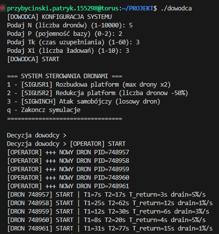

### Rój dronów

## 1. Ogólny opis projektu

Projekt polega na symulacji cyklu życia **roju autonomicznych dronów**, działających w oparciu o mechanizmy systemów operacyjnych w środowisku Linux/UNIX. System składa się z trzech głównych typów procesów: **dowódcy**, **operatora** oraz **dronów**, które współpracują ze sobą i komunikują się przy użyciu procesów, wątków, sygnałów oraz mechanizmów IPC.

Każdy dron funkcjonuje jako niezależna jednostka wykonawcza, realizując cykl:
**lot → powrót do bazy → ładowanie → ponowny start**.  
Liczba dronów jest dynamiczna i zależna od decyzji dowódcy oraz dostępnej pojemności bazy. Ograniczenia systemowe obejmują m.in. maksymalną liczbę dronów w bazie, jednokierunkowy ruch w wąskich wejściach do bazy, czas lotu zależny od poziomu naładowania baterii oraz ryzyko zniszczenia drona przy jej całkowitym rozładowaniu.

Dowódca systemu zarządza globalnymi parametrami roju poprzez wysyłanie sygnałów do operatora i pojedynczych dronów (np. rozbudowa platform startowych, redukcja floty, atak samobójczy). Operator odpowiada za uzupełnianie braków w liczbie dronów, o ile pozwala na to aktualna pojemność bazy.

Cała symulacja generuje **raport tekstowy**, zapisywany do plików, dokumentujący przebieg działania systemu, zdarzenia oraz aktualne stany dronów.

Projekt ma na celu praktyczne wykorzystanie i zaprezentowanie **kluczowych funkcji systemowych** związanych z zarządzaniem procesami, wątkami, synchronizacją, komunikacją międzyprocesową, obsługą sygnałów oraz operacjami na plikach.

## 2. Ogólny opis kodu

Projekt został podzielony na **kilka logicznie rozdzielonych plików źródłowych**, z których każdy odpowiada za odrębny element symulowanego systemu. Taki podział ułatwia rozwój projektu, zwiększa czytelność kodu oraz pozwala na łatwiejsze testowanie i debugowanie poszczególnych komponentów.

## 2.1. Struktura projektu

- **`dowodca.c`**  
  Główny proces sterujący symulacją. Odpowiada za inicjalizację parametrów systemu (liczba dronów, pojemność bazy, czasy), tworzenie procesu operatora oraz obsługę interfejsu decyzyjnego dowódcy. Realizuje wysyłanie sygnałów sterujących do operatora oraz nadzoruje poprawne zakończenie systemu.

- **`operator.c`**  
  Proces pośredniczący pomiędzy dowódcą a dronami. Odpowiada za tworzenie i usuwanie dronów, reagowanie na sygnały dowódcy (rozbudowa, redukcja, atak), okresowe uzupełnianie liczby dronów oraz sprzątanie zakończonych procesów potomnych. Zarządza również zasobami współdzielonymi systemu.

- **`dron.c`**  
  Implementacja pojedynczego drona jako autonomicznego procesu. Dron realizuje własny cykl życia (lot, powrót, ładowanie), zarządza poziomem baterii oraz reaguje na sygnały systemowe (atak samobójczy). Logika drona uwzględnia ograniczenia bazy, dostępność wejść oraz warunki awaryjne.

- **`semafory.c`**  
  Moduł odpowiedzialny za synchronizację dostępu do pamięci współdzielonej przy użyciu semaforów System V. Zapewnia ochronę sekcji krytycznych i spójność danych globalnych.

- **`pamiec.c`**  
  Obsługa segmentów pamięci dzielonej. Plik odpowiada za tworzenie, podłączanie, odłączanie oraz usuwanie pamięci współdzielonej używanej do przechowywania aktualnego stanu systemu.

- **`kolejka.c`**  
  Implementacja kolejek komunikatów System V wykorzystywanych do synchronizacji dostępu do wejść bazy. Kolejka pełni rolę mechanizmu kontroli jednokierunkowego ruchu dronów przez dwa wąskie wejścia.

- **`log.c`**  
  Moduł odpowiedzialny za rejestrowanie przebiegu symulacji. Zapewnia spójny, czasowo oznaczony zapis zdarzeń do pliku logu.

- **`bledy.c`**  
  Prosty moduł pomocniczy do obsługi błędów krytycznych i kończenia programu w przypadku niepowodzeń operacji systemowych.

- **`shared.h`**  
  Wspólny plik nagłówkowy zawierający deklaracje struktur, zmiennych globalnych oraz prototypy funkcji używanych w całym projekcie.

## 2.2. Zastosowane rozwiązania zwiększające wydajność i stabilność

- **Asynchroniczna komunikacja za pomocą sygnałów**  
  Sygnały systemowe pozwalają na natychmiastową reakcję procesów bez konieczności ciągłego odpytywania stanu.

- **Minimalizacja sekcji krytycznych**  
  Dostęp do pamięci współdzielonej jest chroniony semaforami tylko w niezbędnych fragmentach kodu, co ogranicza czas blokowania i poprawia równoległość działania procesów.

- **Dynamiczne zarządzanie zasobami**  
  Lista aktywnych dronów jest alokowana dynamicznie i rozszerzana w razie potrzeby, co pozwala na efektywne wykorzystanie pamięci.

- **Obsługa sygnałów SIGCHLD**  
  Zapewnia bieżące usuwanie zakończonych procesów dronów, zapobiegając powstawaniu procesów zombie.

---
## 3. Zrealizowane funkcjonalności

W ramach projektu udało się zaimplementować pełną symulację cyklu życia roju autonomicznych dronów,
zgodnie z założeniami projektowymi. Zrealizowane zostały następujące elementy:

- utworzenie trzech współpracujących typów procesów: dowódcy, operatora oraz dronów,
- dynamiczne tworzenie i usuwanie dronów z wykorzystaniem procesów potomnych,
- komunikacja międzyprocesowa przy użyciu sygnałów systemowych,
- synchronizacja dostępu do zasobów współdzielonych za pomocą semaforów System V,
- współdzielenie globalnego stanu systemu przy użyciu pamięci dzielonej,
- kontrola dostępu do dwóch wąskich wejść bazy przy użyciu kolejek komunikatów,
- realistyczna symulacja poziomu baterii, czasu lotu, powrotu oraz ładowania dronów,
- obsługa sytuacji awaryjnych (zniszczenie drona w locie, atak samobójczy, brak miejsc w bazie),
- poprawne i uporządkowane zakończenie systemu wraz ze zwolnieniem zasobów IPC,
- generowanie szczegółowego raportu z przebiegu symulacji w plikach tekstowych.

---

## 4. Napotkane problemy i trudności

Podczas realizacji projektu napotkano kilka istotnych problemów technicznych, głównie związanych
z równoległością oraz komunikacją międzyprocesową:

- **Synchronizacja dostępu do pamięci współdzielonej**  
  W początkowej wersji projektu występowały warunki wyścigu podczas jednoczesnej modyfikacji liczników
  dronów. Problem został rozwiązany poprzez zawężenie sekcji krytycznych i konsekwentne użycie semaforów.

- **Obsługa sygnałów i procesów zombie**  
  Występowały sytuacje, w których zakończone procesy dronów nie były poprawnie usuwane.
  Zastosowanie obsługi sygnału `SIGCHLD` oraz `waitpid()` rozwiązało ten problem.

- **Asynchroniczność sygnałów**  
  Sygnały mogły być dostarczane w dowolnym momencie wykonywania kodu, co wymagało zastosowania
  zmiennych typu `volatile sig_atomic_t` oraz dodatkowych sprawdzeń stanu drona.

- **Koordynacja dostępu do wejść bazy**  
  Trudność stanowiło zapewnienie jednokierunkowego ruchu w dwóch wąskich wejściach bazy.
  Problem rozwiązano poprzez wykorzystanie kolejek komunikatów jako mechanizmu przydziału wejść.

- **Testowanie scenariuszy brzegowych**  
  Równoczesne zakończenie wielu dronów, redukcja platform do zera lub atak na drona w trakcie ładowania
  ujawniały błędy logiczne, które wymagały dodatkowych zabezpieczeń i sprawdzeń warunków.  
  Problemy te zostały rozwiązane poprzez dodanie jawnych kontroli stanu systemu, zabezpieczenie
  operacji na licznikach semaforami oraz wprowadzenie dodatkowych warunków kończących symulację
  w sposób uporządkowany (zamykanie systemu przez operatora po wyczerpaniu dostępnych zasobów).

## 5. Wyróżniające się elementy specjalne

- **Obsługa wielu scenariuszy awaryjnych**  
  Projekt uwzględnia rzadkie i trudne przypadki, takie jak atak na drona w trakcie ładowania,
  rozładowanie baterii podczas oczekiwania na wejście do bazy czy redukcja liczby platform
  w trakcie aktywnej pracy systemu.

- **Rozbudowane logowanie zdarzeń**  
  Log zawiera szczegółowe informacje o stanie każdego drona (lot, powrót, ładowanie,
  zniszczenie, utylizacja), co umożliwia późniejszą analizę przebiegu symulacji oraz
  diagnozowanie problemów współbieżności.

- **Dynamiczny i niedeterministyczny charakter symulacji**  
  Losowe czasy lotu, ładowania oraz zużycia baterii powodują, że każda symulacja przebiega
  inaczej. Utrudnia to testowanie, ale lepiej odwzorowuje zachowanie rzeczywistych systemów
  autonomicznych.
  
## 6. Przeprowadzone testy

W celu weryfikacji poprawności działania systemu, spełnienia założeń projektowych
oraz sprawdzenia zachowania symulacji w różnych scenariuszach, przeprowadzono
następujące testy funkcjonalne i scenariusze użytkowe:

1. Skonfigurowanie roju dronów (parametry N, P, Tk, Xi) oraz poprawne uruchomienie programu  
2. Test wysłania sygnału 3 – atak samobójczy losowego drona  
3. Test wysłania sygnału 2 – redukcja platform startowych w trakcie działania systemu  
4. Test wysłania sygnału 1 – rozbudowa platform startowych w trakcie działania systemu  
5. Test zakończenia programu oraz poprawnego sprzątania zasobów (pamięć dzielona, kolejki komunikatów, semafory)  
6. Obserwacja logów dronów podczas lotu oraz zmiany ich stanów  
7. Test utylizacji dronów po osiągnięciu określonej liczby ładowań (Xi)  
8. Test powrotu dronów do bazy i przejścia przez jedno z dwóch istniejących wejść  
9. Test pojemności bazy – weryfikacja, że baza nie przyjmuje więcej niż P < N/2 dronów jednocześnie

